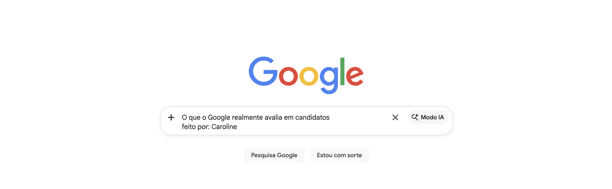

> ⚠️ Este material está em construção

O Google recebe milhões de currículos todos os anos, menos de 0,2% são contratados, a maioria dos candidatos se prepara da forma errada.

Este estudo de caso mostra como um dos processos seletivos mais exigentes do mundo realmente funciona e por que bons candidatos são eliminados.

## O que você vai entender

▸ Por que habilidade técnica sozinha não é suficiente  

▸ O que realmente avalia em entrevistas

▸ Por que bons candidatos não avançam  

▸ O que diferencia quem passa de quem é eliminado  
